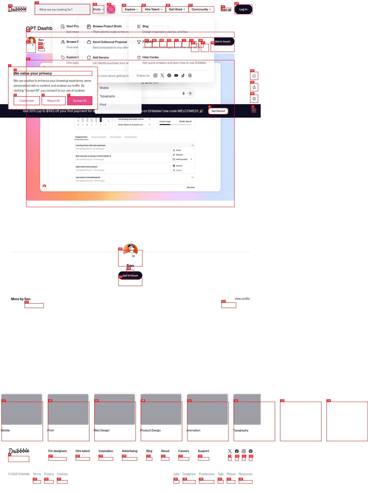

# MetaGPT UI Configurator

[](https://github.com/j4207640-code/my-metagpt-ui)
[](LICENSE)
[](https://github.com/j4207640-code/my-metagpt-ui/releases)



## Descrição

Esta aplicação é uma interface web (Streamlit) que permite configurar um agente MetaGPT. Ela permite escolher o provedor LLM, definir modelo, temperatura, e definir os papéis (roles) dos agentes. A configuração é salva em `config.json`.

## Requisitos

- Python 3.11+
- [uv](https://github.com/astral-sh/uv) (versão recomendada)

## Instalação

```bash
# Clonar o repositório
git clone https://github.com/j4207640-code/my-metagpt-ui.git
cd my-metagpt-ui

# Instalar dependências com uv
uv pip install -r requirements.txt
```

## Execução

```bash
streamlit run app.py
```

A aplicação será aberta no navegador em `http://localhost:8501`.

## Configuração

1. Selecione o provedor LLM.
2. Insira a chave de API (quando necessário).
3. Escolha o modelo e ajuste a temperatura.
4. Defina o número de agentes e seus papéis.
5. Clique em **Salvar Configuração** para gerar `config.json`.

O arquivo `config.json` contém a configuração atual e pode ser usado pelo seu código MetaGPT.

## Uso do uv

O projeto foi configurado para usar **uv** como gerenciador de pacotes. Para instalar as dependências, execute:

```bash
uv pip install -r requirements.txt
```

## Testes

Não há testes automatizados neste projeto. Teste manualmente executando o app e verificando a geração do `config.json`.

## Contribuição

Contribuições são bem-vindas! Sinta‑se à vontade para abrir issues ou pull requests.

## Licença

MIT License © 2026 j4207640-code